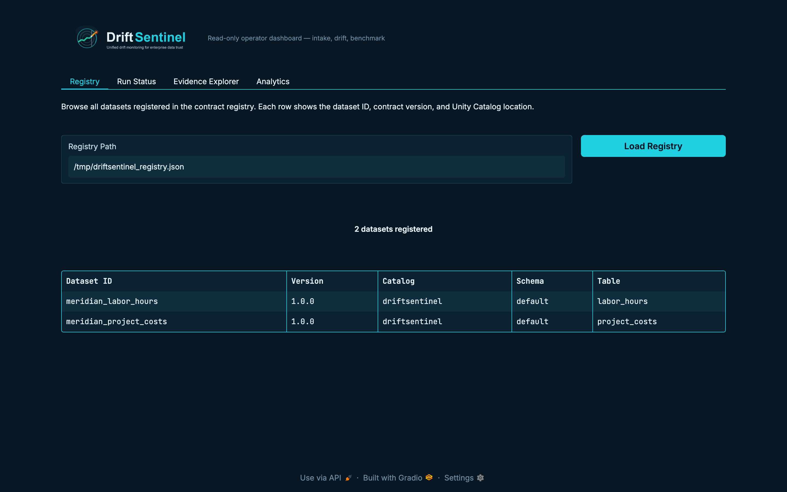
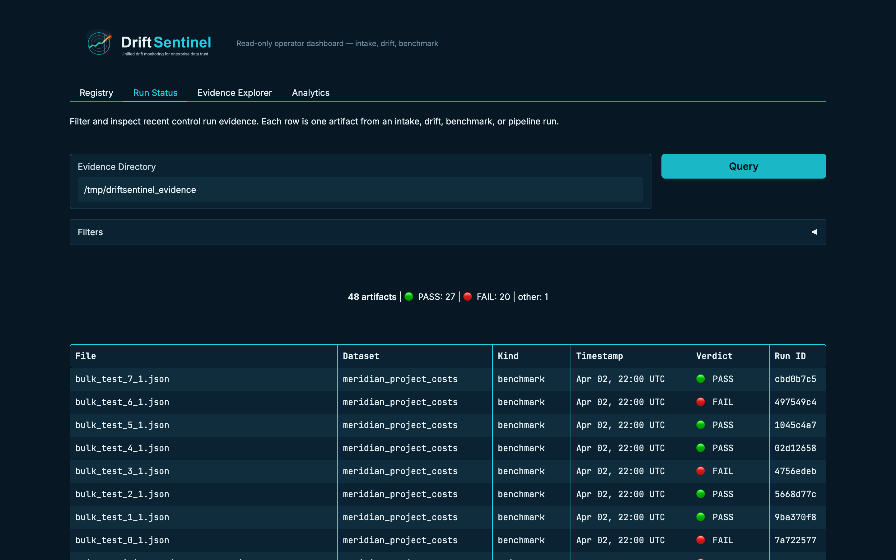
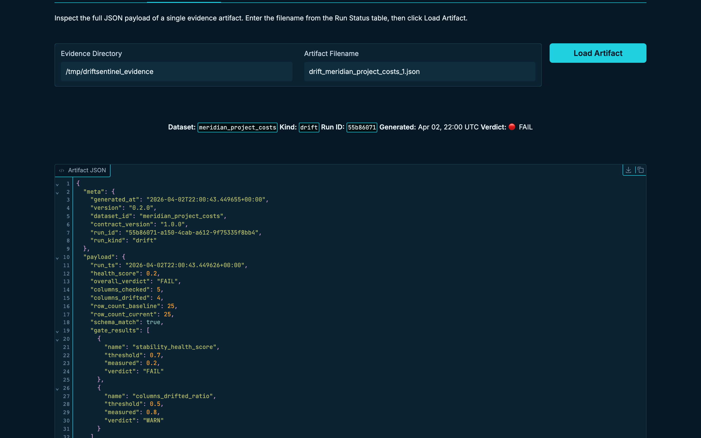
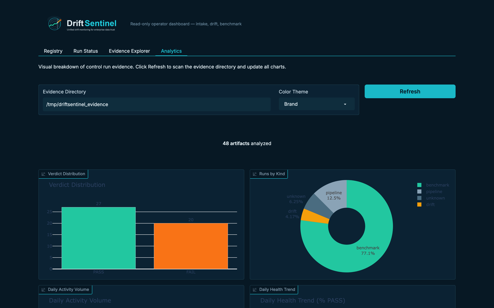

<p align="center">
  
</p>

# Three Control Patterns. Multiple Datasets. One Platform That Proves All of Them Are Working.

**Enterprise Data Trust — Chapter 4: DriftSentinel**

Built by Anthony Johnson | EthereaLogic LLC

---

<p align="left">
  <a href="https://github.com/Org-EthereaLogic/DriftSentinel/actions/workflows/ci.yml"></a>
  <a href="https://app.codacy.com/gh/Org-EthereaLogic/DriftSentinel/dashboard"></a>
  <a href="https://codecov.io/gh/Org-EthereaLogic/DriftSentinel"></a>
</p>

---

The first three chapters of Enterprise Data Trust prove three things: data can be certified at intake, distribution drift can be gated before publication, and control effectiveness can be measured against known failure scenarios. Each chapter solves one problem in isolation.

DriftSentinel solves the next one: running all three control patterns together, across multiple registered datasets, in a production Databricks environment — with append-only evidence for every run and an operator dashboard the platform team can actually use.

Three modules. One registry. Queryable evidence. No assumption that any run passed unless the artifact says so.

## Executive Summary

| Leadership question | Answer |
| ------------------- | ------ |
| What business risk does this address? | Enterprises with mature data quality patterns still lack a unified platform for running intake certification, drift gating, and control benchmarking across multiple datasets with governed, queryable evidence. |
| What does this application prove? | A Databricks-deployable application that registers datasets against versioned contracts, runs all three control patterns through a single orchestration layer, and surfaces queryable evidence artifacts in a read-only operator dashboard. |
| Why does it matter? | Proving that controls work on one dataset, once, is a starting point. This chapter proves that the same evidence discipline applies across multiple datasets, in a governed deployment, with an audit trail the platform team can inspect without writing scripts. |

## Key Exhibits

### Exhibit 1: Dataset Contract Registry

The operator dashboard loads the active registry and shows every registered dataset with its contract version and Unity Catalog location. Two datasets registered — `meridian_labor_hours` and `meridian_project_costs` — both at version 1.0.0, bound to the `driftsentinel` catalog.

<p align="center">
  
</p>

### Exhibit 2: Control Run Evidence at a Glance

The Run Status tab surfaces 48 evidence artifacts across intake, drift, and benchmark runs — 27 PASS, 20 FAIL, and 1 other. Every row is one artifact: dataset, kind, timestamp, verdict, and run ID. The verdict column makes failures immediately visible without opening a single file.

<p align="center">
  
</p>

### Exhibit 3: Full Evidence Artifact Inspection

The Evidence Explorer loads a single evidence artifact by filename and renders the complete JSON payload inline. The artifact shown is a drift run against `meridian_project_costs` with a FAIL verdict: health score 0.2, four columns drifted, gate results visible with measured values recorded alongside thresholds.

<p align="center">
  
</p>

### Exhibit 4: Visual Analytics Across All Control Runs

The Analytics tab scans the evidence directory and renders four charts: verdict distribution, runs by kind (intake, drift, benchmark), daily activity volume, and daily health trend. 48 artifacts analyzed from a single shared evidence directory — no manual aggregation.

<p align="center">
  
</p>

## The Business Problem

Enterprises that reach this level of data trust maturity have solved the individual problems. They still face three operational gaps:

- **Multiple datasets require coordinated governance.** Running intake certification for one dataset is a pattern. Running it across several — with version-aware contracts, consistent policy bindings, and a shared evidence store — is a platform problem.
- **Evidence is only useful if it is queryable.** Append-only JSON artifacts are the right evidence discipline, but they are not useful to a platform team without a way to filter by dataset, kind, verdict, and run ID without writing scripts.
- **A Databricks deployment needs to be reproducible.** A control pattern that runs locally in Python is a proof of concept. One that deploys with a validated Asset Bundle, runs on Databricks compute, and exposes a governed Databricks App is a product.

These are not hypothetical gaps. They are the operational reality of any team that has graduated from individual control patterns to platform-level governance.

## What This Repository Contains

| Surface | Purpose |
| ------- | ------- |
| `src/driftsentinel/intake/` | Schema drift detection and contract validation (Chapter 1 pattern) |
| `src/driftsentinel/drift/` | Distribution drift detection and gate logic (Chapter 2 pattern) |
| `src/driftsentinel/benchmark/` | Control effectiveness benchmarking against known failure scenarios (Chapter 3 pattern) |
| `src/driftsentinel/evidence/` | Append-only evidence artifact writing shared across all three modules |
| `src/driftsentinel/orchestration/` | Workflow sequencing — runs all three control patterns in order for each registered dataset |
| `src/driftsentinel/config/` | Dataset contract and policy configuration |
| `app/` | Databricks App (Gradio) — four-tab read-only operator dashboard |
| `notebooks/` | Onboarding, execution, and evidence-review notebooks for Databricks |
| `resources/` | Databricks Asset Bundle pipeline, job, and app resource definitions |
| `templates/` | Dataset contract, drift policy, and benchmark policy templates |
| `specs/` | Canonical SDLC documents governing the product |
| `tests/` | 308-test suite covering domain logic, packaging, and governance |

Every directory above contains a `README.md` describing its contents, including each submodule under `src/driftsentinel/`.

## What This Repository Proves

| Verified outcome | Evidence from this repository |
| ---------------- | ----------------------------- |
| Multi-dataset registry operates with version-aware contracts | 2 datasets registered at v1.0.0 — visible in the Registry tab with catalog and table location |
| All three control patterns produce evidence through one orchestration layer | Intake, drift, and benchmark artifacts present in a single shared evidence directory |
| Evidence artifacts are queryable without writing scripts | Run Status tab filters 48 artifacts by dataset, kind, verdict, and run ID |
| FAIL verdicts surface measurable gate results | Drift FAIL artifact shows health score 0.2, 4 columns drifted, gate thresholds recorded |
| Databricks deployment is reproducible from source | Asset Bundle validates, deploys, and runs via `make bundle-validate` and `make app-deploy` |

## Decision / KPI Contract

**Business decision:** is the full data control pipeline healthy across all registered datasets?

| KPI | Meaning |
| --- | ------- |
| `overall_verdict` | PASS / WARN / FAIL for each control run artifact |
| `health_score` | Distribution stability score from drift runs (0.0–1.0) |
| `quality_recall` | Percentage of injected quality failures caught by benchmark runs |
| `columns_drifted` | Count of columns whose distribution shifted beyond threshold in a drift run |
| `artifacts_pass_rate` | Ratio of PASS artifacts to total artifacts in the evidence directory |

**Control rule:** no run is assumed to have passed unless a PASS artifact exists in the evidence directory. FAIL artifacts carry gate results with measured values and thresholds so the platform team can triage without opening raw files.

## Why This Pattern

- **Gap 1.** Control patterns must share an evidence discipline. Intake, drift, and benchmark runs each write to the same append-only evidence directory using the same artifact schema. A single dashboard surfaces all three without special-casing any module.
- **Gap 2.** The registry must be version-aware. As contracts evolve, older run artifacts retain the contract version that was active when they were produced. Evidence is never retroactively modified.
- **Gap 3.** The operator dashboard must be read-only. The Gradio app exposes no write surfaces. Evidence is queried, never edited through the UI. This keeps the audit trail clean and the deployment governance simple.

## How It Works

1. **Register datasets.** Each dataset is registered with a contract YAML specifying the Unity Catalog location, schema contract, drift policy, and benchmark policy.
2. **Run the control pipeline.** The orchestration layer runs intake certification, drift gating, and control benchmarking in sequence. Each module writes an append-only evidence artifact to the shared evidence directory.
3. **Inspect run status.** The Run Status tab surfaces all artifacts with verdicts, timestamps, and run IDs. FAIL rows are immediately visible — no file parsing required.
4. **Explore individual artifacts.** The Evidence Explorer loads any single artifact by filename and renders the full JSON payload, including gate results with measured values and thresholds.
5. **Review analytics.** The Analytics tab scans the evidence directory and renders verdict distribution, runs-by-kind breakdown, daily activity volume, and health trend over time.

## Databricks Fit

- **Databricks Asset Bundles** for source-controlled deployment of pipeline, job, and app resource definitions — validated and deployed from the repo with a single make target.
- **Databricks Apps (Gradio)** for a governed, read-only operator dashboard with no custom web infrastructure required.
- **Unity Catalog** for governed table publication and the evidence volume backing the operator dashboard.
- **Databricks Lakeflow / Jobs** for scheduled control pipeline execution across registered datasets.
- DriftSentinel is dataset-agnostic — the registry and policy binding handle per-dataset configuration regardless of schema shape or source system.

## Quickstart

### Install via pip

The fastest way to get the DriftSentinel package into your environment:

```bash
pip install etherealogic-driftsentinel
```

This installs the full DriftSentinel package — intake certification, drift gating, benchmarking, orchestration, evidence writer, and bundled contract and policy templates.

### Clone and develop locally

To run the full test suite or contribute:

```bash
git clone https://github.com/Org-EthereaLogic/DriftSentinel.git
cd DriftSentinel

make sync   # installs runtime + dev dependencies via uv
make test   # runs the 308-test suite
```

### Databricks Bundle and App Deployment

```bash
# First prove the catalog exists for your profile.
make bundle-catalog-check CATALOG=my_catalog PROFILE=<profile>

# Validate bundle wiring against that catalog.
make bundle-validate CATALOG=my_catalog PROFILE=<profile>

# Deploy bundle resources and start the Databricks App.
make app-deploy CATALOG=my_catalog PROFILE=<profile>
```

Direct CLI path:

```bash
databricks catalogs get my_catalog -p <profile>
databricks bundle validate -p <profile> --target dev --var="catalog=my_catalog"
databricks bundle deploy -p <profile> --target dev --var="catalog=my_catalog"
databricks apps start driftsentinel -p <profile>
databricks apps deploy -p <profile> --target dev --var="catalog=my_catalog"
databricks apps get driftsentinel -p <profile> -o json
```

`bundle validate` proves bundle, auth, and resource resolution. `databricks apps get` is the proof surface for `SUCCEEDED` plus `RUNNING`.

### Notebook Import

Import the `notebooks/` directory into your Databricks workspace to run the control pipeline from the deployed bundle or standalone from GitHub. Notebooks ship with bundled example templates. `01_register_dataset.py` and `05_run_control_benchmark.py` also accept optional workspace YAML paths for customized contracts from `templates/`.

## AI-Assisted Setup

If you use an AI coding agent (Claude Code, Cursor, GitHub Copilot Workspace, or similar), paste the prompt below directly into your agent session. The agent will clone the repository, install dependencies, run the full test suite, and walk you through the Databricks deployment — no manual steps required.

**Before you start, have these ready:**

- Python 3.11+
- `uv` package manager — install with `pip install uv`
- Databricks CLI configured with a valid profile — run `databricks auth login` if needed
- A Databricks workspace with Unity Catalog enabled
- The name of your Unity Catalog catalog

**Copy and paste this prompt into your AI coding agent:**

````
I want to set up DriftSentinel — a Databricks-deployable data trust platform that
unifies intake certification, drift detection, and control benchmarking in a single
application with a four-tab operator dashboard.

Repository: https://github.com/Org-EthereaLogic/DriftSentinel

Please complete these steps in order. Stop at any failure and report it before continuing.

1. Clone the repository:
   git clone https://github.com/Org-EthereaLogic/DriftSentinel.git
   cd DriftSentinel

2. Install dependencies (requires uv):
   make sync
   If uv is not installed: pip install uv

3. Run the full test suite. All 308 tests must pass before proceeding:
   make test

4. Read these files to understand the configuration model before deployment:
   - README.md
   - templates/dataset_contract.yaml
   - templates/drift_policy.yaml
   - templates/benchmark_policy.yaml

5. Ask me for my Databricks setup details:
   - My Unity Catalog catalog name
   - My Databricks CLI profile name
   Then confirm the catalog is reachable:
   make bundle-catalog-check CATALOG=<my_catalog> PROFILE=<my_profile>

6. Validate the Asset Bundle against my workspace:
   make bundle-validate CATALOG=<my_catalog> PROFILE=<my_profile>

7. If validation passes, deploy the bundle and start the Databricks App:
   make app-deploy CATALOG=<my_catalog> PROFILE=<my_profile>

8. Verify the deployment succeeded:
   databricks apps get driftsentinel -p <my_profile> -o json
   Confirm the status shows SUCCEEDED and RUNNING, then report the app URL.

After every step, report what happened. Do not skip a step or proceed past any
error without explaining it and asking me how to continue.
````

## Scope Boundary

DriftSentinel validates the unified control platform using registered datasets in a local and Databricks environment. It does not constitute production-scale proof across arbitrary schema shapes or multi-workspace deployments. The registry, evidence model, and orchestration pattern are dataset-agnostic; the Databricks deployment path requires a workspace with Unity Catalog enabled.

## Engineering Signals

- GitHub Actions workflow: [ci.yml](https://github.com/Org-EthereaLogic/DriftSentinel/actions/workflows/ci.yml)

## Additional Documentation

- [Architecture and design rationale](specs/DS-SDD-001_Architecture_Blueprint.md)
- [Implementation plan](specs/DS-IP-001_Implementation_Plan.md)
- [Deployment guide](docs/deployment_guide.md)

## Part of a Series

This is **Chapter 4** of the *Enterprise Data Trust* portfolio — a four-chapter body of work addressing the full lifecycle of data reliability in enterprise Databricks platforms.

| Chapter | Focus | Repository |
| ------- | ----- | ---------- |
| 1. Trusted Source Intake | Validate and certify data before downstream consumption | [trusted-source-intake](https://github.com/Org-EthereaLogic/trusted-source-intake) |
| 2. Silent Failure Prevention | Detect distribution drift before it reaches executive dashboards | [silent-failure-prevention](https://github.com/Org-EthereaLogic/silent-failure-prevention) |
| 3. Measurable Control Effectiveness | Prove that your data controls work against known failure scenarios | [measurable-control-effectiveness](https://github.com/Org-EthereaLogic/measurable-control-effectiveness) |
| **4. DriftSentinel** | Unified application combining all three control patterns | ← You are here |

---

MIT License. See [LICENSE](LICENSE) for details.
